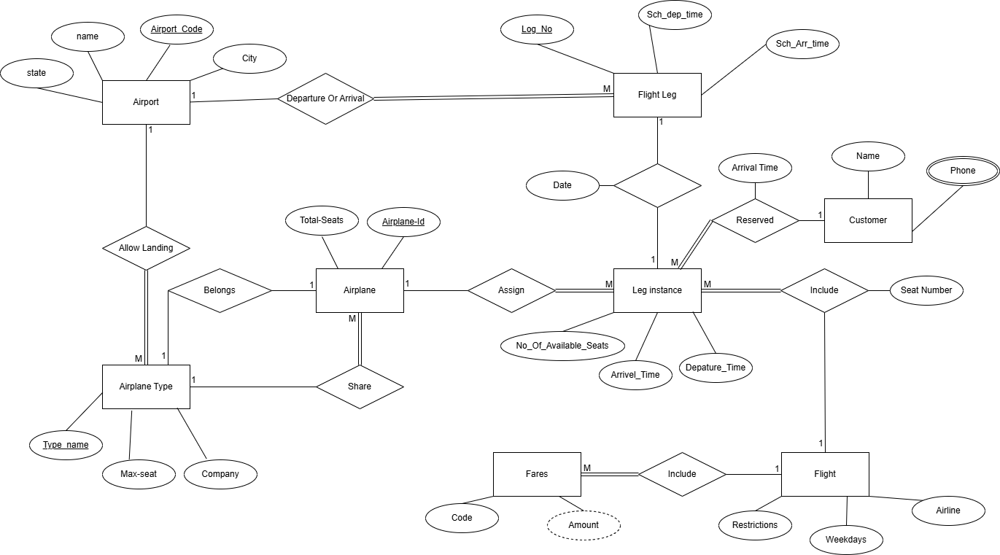
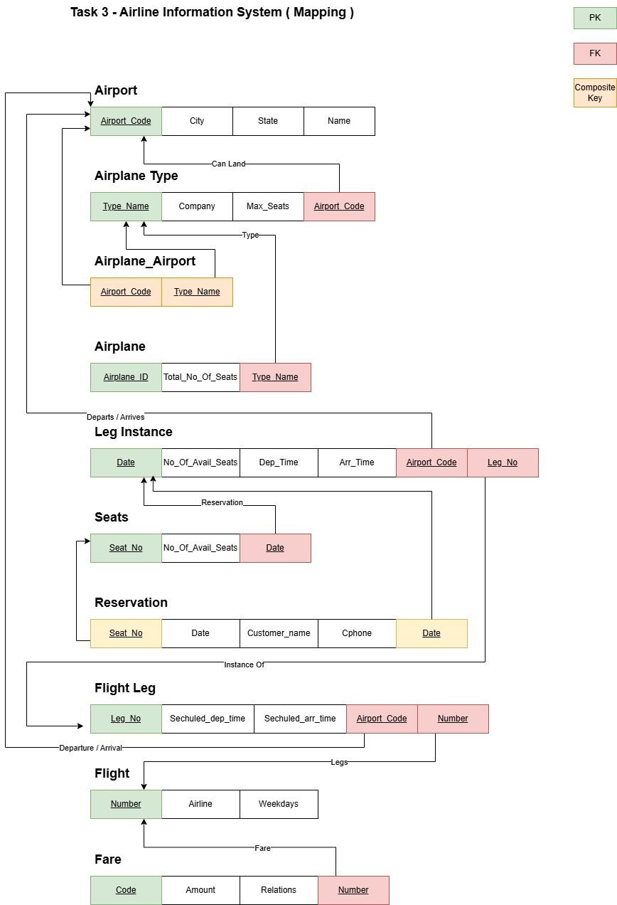

# Airline Information System 

## Airline Information System Requirements
### An airline system is needed to manage flight operations, schedules, reservations, and related data:

- **AIRPORT**
	- Each airport has a unique airport_code.
	- It stores city, state, and name.
	- An airport can serve as a departure or arrival point for many flight legs.
	- An airport may allow landing of different airplane types.
- **FLIGHT LEG**
	- Each flight leg is uniquely identified by a leg_no.
	- A leg has a scheduled_dep_time and scheduled_arr_time.
	- A leg departs from and arrives at an airport.
- **LEG INSTANCE**
	- A leg instance is a specific occurrence of a flight leg on a given date.
	- It includes:
		- Arrival time
		- Departure time
		- Number of available seats
	- It is assigned an airplane and connected to seat reservations.
- **AIRPLANE TYPE**
	- Defined by a type_name, company, and max_seats.
	- Multiple airplanes can share a type.
- **AIRPLANE**
	- Identified by airplane_id. 
	- Has a total number of seats.
	- Each airplane belongs to a specific type.
	- Assigned to leg instances.
- **SEAT / RESERVATION**
	- A reservation is made by a customer with name and phone.
	- It is linked to a specific seat number in a leg instance.
- **FLIGHT & FARE**
	- A flight includes multiple legs.
	- Flights have attributes like: 
		- Airline
		- Weekdays
		- Restrictions
	- Each flight can have multiple fares, with:
		- Code
		- Amount
-----------------------------------------------

## ERD Diagram of Airline Information System
-----------------

-----------------

## Airline Information System Mapping 

