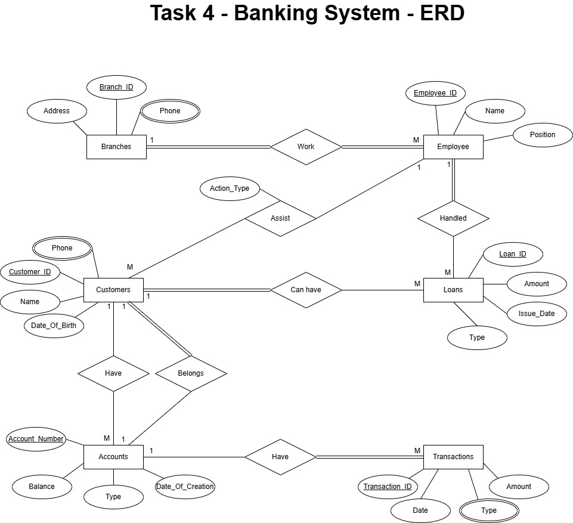

# Banking System 

## Banking System Requirements

- **Scenario:**
	- A bank needs a system to manage customer accounts, employees, loans, and transactions.
- **Requirements:**
	1. The bank operates multiple branches, each with a branch ID, address, and phone number.
	2. Customers can have multiple accounts, but each account belongs to only one customer.
	3. Customers are identified by a customer ID, name, address, phone number, and date of birth.
	4. Each account has an account number, balance, type (savings/checking), and date of creation.
	5. Each account can have multiple transactions (withdrawals, deposits, transfers), each with a unique 
transaction ID, date, amount, and type.
	1. Loans are provided to customers, with each loan having an ID, type, amount, and issue date.
	1. A customer can have multiple loans, but each loan is handled by a specific employee.
	1. Employees are identified by employee ID, name, position, and branch ID (they work in one branch).
	1. Employees may assist customers in opening accounts or processing loans (relationship attribute: 
action_type).
- **Tasks:**
	- **ERD Creation:**
		- Identify all entities, weak entities (e.g., transactions), attributes, relationships, and keys.
		- Include multivalued or derived attributes if needed.
		- Use role-based attributes on many-to-many relationships (e.g., employee-customer interactions).
	- **Relational Mapping:**
		- Transform your ERD into database tables.
		- Include mapping for:
			- Strong & weak entities
			- 1:N and M:N relationships
			- Relationship attributes
		- Indicate any NOT NULL constraints due to total participation. 
-------------------------

## ERD Diagram of Banking System
