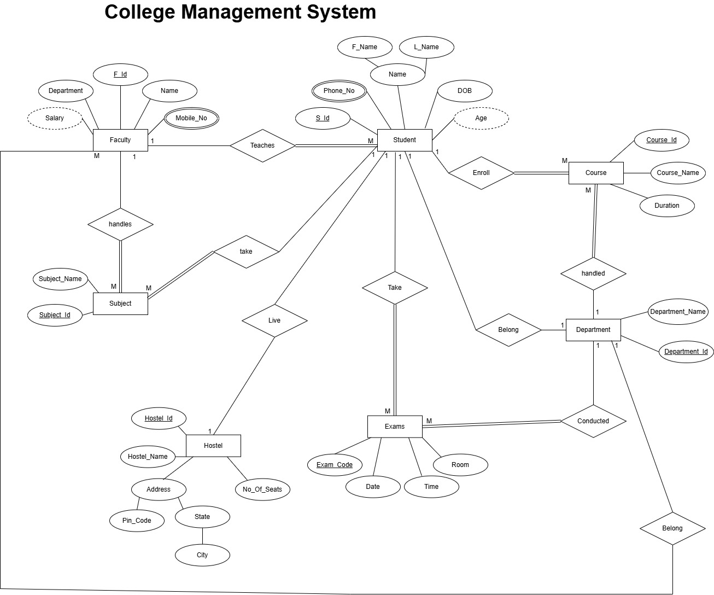
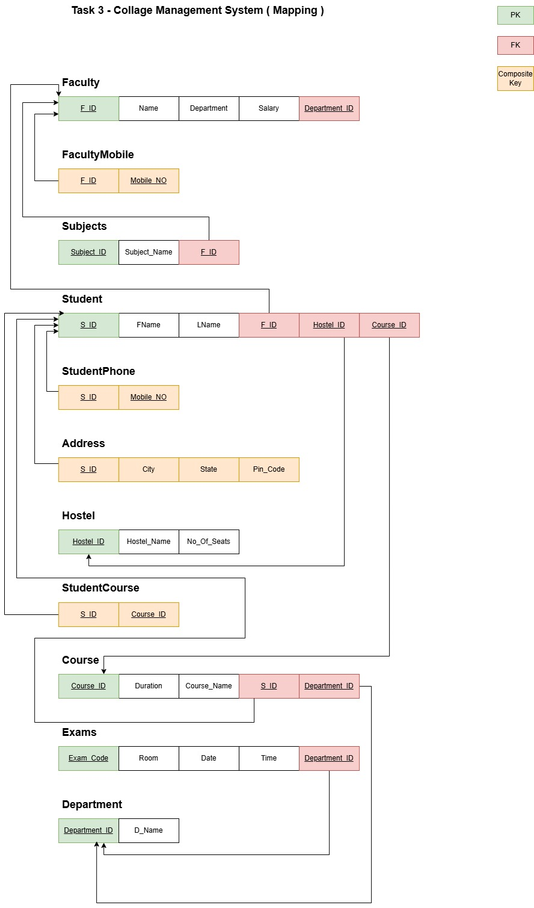

# College Management System
##  College Management System Requirements

### A college database system is needed to manage students, faculty, courses, hostels, and examinations: 
- **FACULTY**
	- Identified by F_id. 
	- Attributes: Name, Mobile_no, Department, Salary.
	- Teaches multiple students and handles subjects.
- **STUDENT**
	- Identified by S_id. 
	- Attributes: F_name, L_name, Name, Phone_no, DOB, and Age (derived). 
	- Can: 
		- Enroll in multiple courses.
		- Belong to a department.
		- Take multiple exams
		- Live in a hostel
- **HOSTEL**
	- Identified by Hostel_id.
	- Attributes: Hostel_name, City, State, Address, Pin_code, No_of_seats. 
- **COURSE**
	- Identified by Course_id.
	- Attributes: Course_name, Duration.
	- Courses are handled by departments and have multiple enrolled students.
- **SUBJECT**
	- Each subject has a Subject_id and Subject_name.
	- Students take subjects which are taught by faculty. 
- **EXAMS**
	- Identified by Exam_code.
	- Attributes: Date, Time, Room.
	- Conducted by a department.
- **DEPARTMENT**
	- Identified by Department_id. 
	- Has a D_name. 
	- Handles courses and conducts exams.

-------------------------------
## ERD Diagram of College Management System

-----------------------------

## College Management System Mapping

