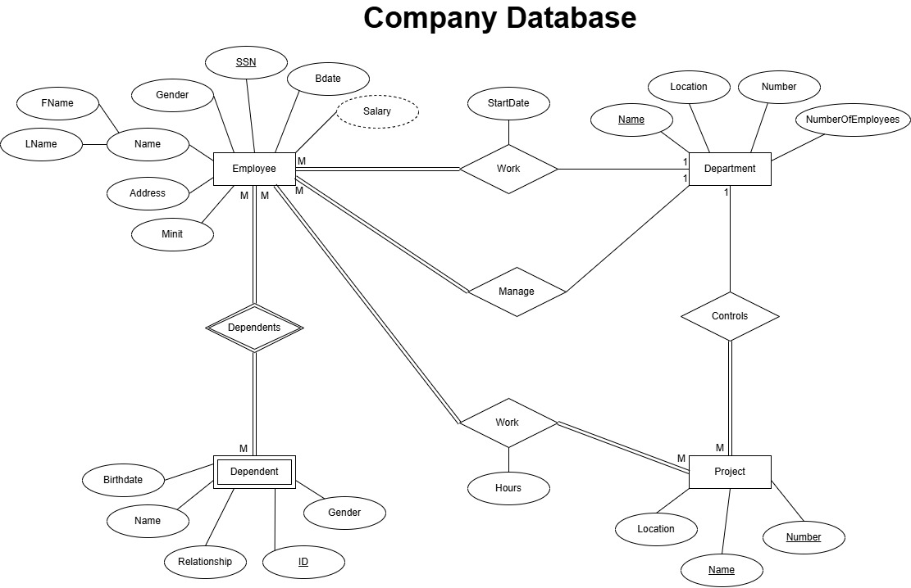
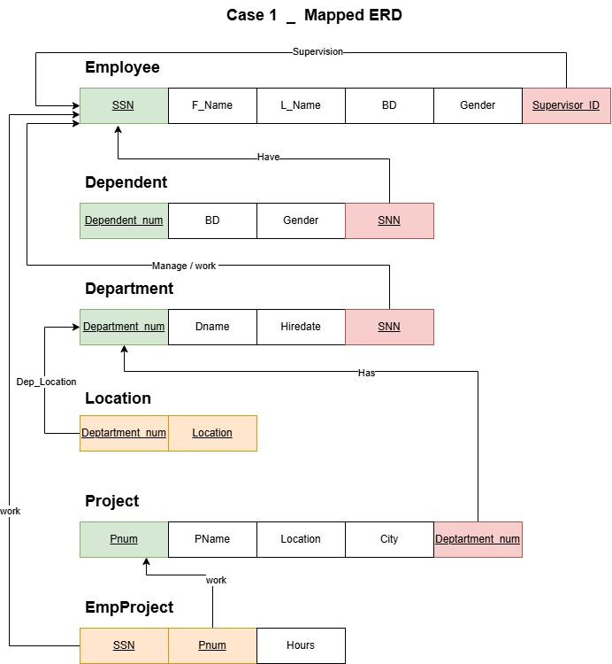

# Company Database

## Company Database Requirements

### This system manages a company's departments, employees, projects, and their dependents: 

- **EMPLOYEE**
	- Identified by SSN.
	- Attributes: Fname, Minit, Lname, Address, Sex, Bdate, Salary.
	- Can:
		- Work for a department with StartDate
		- Supervise other employees
		- Be supervised
		- Work on projects with hours logged
		- Manage departments
		- Have dependents
- **DEPENDENT**
	- Each dependent is related to one employee.
	- Attributes: Name, Sex, Birthdate, Relationship.
- **DEPARTMENT**
	- Identified by Name.
	- Attributes: Number, Locations, NumberOfEmployees.
	- A department: 
		- Controls multiple projects 
		- Is managed by an employee
- **PROJECT**
	- Identified by Name and Number.
	- Attributes: Location
	- Employees work on projects, each with logged hours.
---------------------

## ERD Diagram of Company Database

---------------------

## Company Database Mapping

