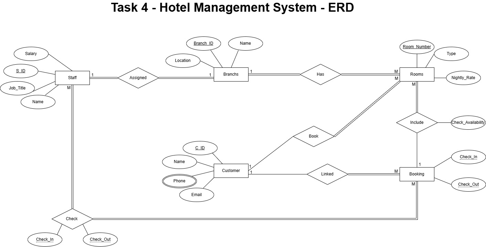

# Hotel Management System

## Hotel Management System Requirements

- **Scenario:**
	- A hotel chain wants to develop a database system to manage its bookings, rooms, customers, and staff across 
multiple branches.
- **Requirements:**
	1. The hotel chain operates in multiple branches, each identified by a branch ID, name, and location.
	1. Each branch has multiple rooms, each identified by a room number, type, and nightly rate.
	1. A customer can book one or more rooms, and each booking includes a check-in and check-out date.
	1. A booking is linked to a customer and can include multiple rooms.
	1. Each customer has a unique ID, name, phone, and email.
	1. Staff are assigned to a specific branch and are identified by ID, name, job title, and salary.
	1. A staff member can check in or check out customers (many-to-many with role attribute like "check-in", 
"check-out"). 
	1. The system should track the availability of each room based on bookings.
-----------------
##  Tasks:

- **ERD Creation:**
	- Identify all entities, attributes (simple, derived, multivalued), and relationships (with participation 
and cardinality). 
	- Clearly identify weak entities if any.
	- Use relationship attributes (e.g., for many-to-many actions like check-in records).
	- Include primary and foreign keys visually.
- **Relational Mapping:**
	- Convert the ERD into tables.
	- Define PKs, FKs, data types, and constraints.
	- Include mapping for multivalued or derived attributes if applicable.
	- Create a linking table for any many-to-many relationships.

-------------------------------------

## ERD Diagram of Hotel Management System
